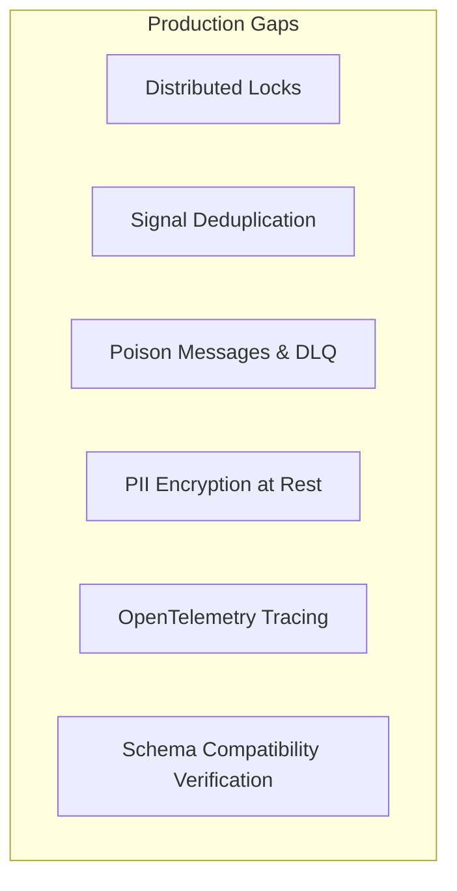

# 📋 Workflows Engine: Missed & Planned Features Analysis

This document details the gaps in the current implementation of the Workflows engine. It categorizes these gaps into **Planned but Unimplemented** (features defined in roadmaps but not yet complete) and **Unplanned "Must-Haves"** (critical production requirements missing from both the codebase and planning documents).

---

## 1. Planned but Unimplemented (or Partially Implemented)

These features have been identified by the development team and are documented in roadmaps but remain incomplete or require significant refactoring.

### 1.1. Distributed Timer Scheduling (`TimeWait`)
*   **Current State**: 🔴 **Fragile (In-Memory)**
*   **The Issue**: The orchestrator's timer scheduler ([Scheduler.cs](file:///d:/MySrc/Workflows/Workflows.Orchestrator/Scheduler.cs)) uses a basic, in-memory `ConcurrentDictionary` and a polling loop. If the application restarts, all active timers are lost.
*   **Solution**: Integrate a reliable, database-backed scheduler like **Hangfire** or **Quartz.NET** to coordinate callbacks.

### 1.2. Side-by-Side (SxS) Version Routing
*   **Current State**: 🔴 **Overwritten in Memory**
*   **The Issue**: The [WorkflowRegistry.cs](file:///d:/MySrc/Workflows/Workflows.Runner/WorkflowRegistry.cs) stores registered workflows strictly by their Name, overwriting other versions in memory. Running instances cannot dynamically resolve or switch to their original version of the C# code if a new version is registered.
*   **Solution**: Introduce a `WorkflowRegistrations` database schema to track exact semantic versions and resolve the target version dynamically from compiled assemblies.

### 1.3. Composite Wait Group Routing & Downward Pruning (`GroupWait`)
*   **Current State**: 🟡 **Partially Implemented**
*   **The Issue**: Although the C# DSL models exist in [GroupWait.cs](file:///d:/MySrc/Workflows/Workflows.Definition/GroupWait.cs), the Orchestrator does not support tracking child execution counts, resolving compound logic (such as early exit on `MatchAny`), or cascading pruning (cancellation) of satisfied sibling waits in the SQL database.
*   **Solution**: Build full group wait aggregation and pruning logic in the Orchestrator.

### 1.4. Optimistic Concurrency Retry Pipeline
*   **Current State**: 🟡 **Partially Implemented**
*   **The Issue**: Concurrency tokens are defined in EF Core schema mappings ([WorkflowsDbContext.cs](file:///d:/MySrc/Workflows/DataStore/Workflows.Storage.EntityFrameworkCore/WorkflowsDbContext.cs)), but the Orchestrator's execution loop does not catch concurrency exceptions or run catch-and-retry execution loops.
*   **Solution**: Wrap the Orchestrator's persistence phase in a transaction retry loop with exponential backoff.

### 1.5. Massive Fan-Out (External State Pattern)
*   **Current State**: 🔴 **Unimplemented (Causes State Bloat)**
*   **The Issue**: Yielding composite waits like `WaitGroup` with thousands of children forces the engine to serialize the entire tree inside the JSON state blob, causing performance degradation.
*   **Solution**: Introduce `WaitMany` or `WaitAny` waits that persist child wait metadata in dedicated relational tables, waking up the engine only when aggregation conditions are met.

### 1.6. Background Database Pruning Worker
*   **Current State**: 🟡 **Partially Implemented**
*   **The Issue**: Active waits are deleted inline in [WorkflowStore.cs](file:///d:/MySrc/Workflows/DataStore/Workflows.Storage.EntityFrameworkCore/WorkflowStore.cs) when completed or cancelled, but no background worker cleans up orphaned rows resulting from hard failures.
*   **Solution**: Implement a background host service that periodically executes SQL queries to purge orphaned wait rows.

### 1.7. High-Performance JSON Serialization
*   **Current State**: 🟡 **Partially Implemented**
*   **The Issue**: Newtonsoft.Json settings are cached, but character array pooling (`ArrayPool<char>`) and direct streaming to/from DB connections are not integrated, leading to garbage collection pressure under heavy load.
*   **Solution**: Refactor the serialization wrapper to leverage array pooling and direct stream reading/writing.

### 1.8. Roslyn Analyzer Workflow Attribute Verification
*   **Current State**: 🟡 **Partially Implemented**
*   **The Issue**: The Roslyn compiler analyzer ([WorkflowAnalyzer.cs](file:///d:/MySrc/Workflows/Workflows.Analyzers/WorkflowAnalyzer.cs)) successfully validates closures, but does not enforce that all workflow containers are decorated with the `[Workflow]` attribute.
*   **Solution**: Extend the analyzer rules to enforce attribute checks.

### 1.9. UI Administration Dashboard
*   **Current State**: 🔴 **Unimplemented**
*   **The Issue**: No visual console or administration panel exists for inspecting workflow DAGs, auditing state parameters, or resolving faults manually.
*   **Solution**: Create a Web UI dashboard backed by dedicated management API endpoints.

---

## 2. Unplanned "Must-Haves" for Production

These features are missing from both the codebase and the current planning documents, but are critical for running the engine in a production environment.

### 2.1. Distributed Lock Registry
*   **Why**: Multiple independent workflow instances may need to read or modify the same external resource. A native DSL mechanism is needed to acquire and release locks (e.g., via Redis or SQL database-backed distributed locks) to avoid race conditions.

### 2.2. Idempotent Signal/Command Processing (Deduplication)
*   **Why**: Most message brokers guarantee "at-least-once" delivery. If a signal is dispatched multiple times, the workflow could advance twice. The database must track signal processing history to ignore duplicates.

### 2.3. Poison Message & Dead Letter Queue (DLQ) Handling
*   **Why**: If a signal payload is malformed or repeatedly crashes the runner during state rehydration, the system needs a way to catch, isolate, and move the message to a DLQ rather than retrying indefinitely and blocking the execution queues.

### 2.4. State Payload Encryption at Rest
*   **Why**: Serialized JSON contexts frequently contain sensitive data (financial data, credentials, PII). Under GDPR/HIPAA compliance, the storage adapters should support column-level encryption before persisting to disk.

### 2.5. Telemetry & OpenTelemetry Integration
*   **Why**: Debugging workflow routing requires tracing requests across the API, message bus, orchestrator, and runner. The system should natively emit OpenTelemetry span data to support visualization in tools like Jaeger or Datadog.

### 2.6. Schema Compatibility Verification Tools
*   **Why**: Modifying C# workflow containers (e.g., removing a yield step or changing variable types) can break in-flight instance rehydration. A CLI verification tool is needed to parse ASTs and warn developers of breaking schema changes before deploying updates.
