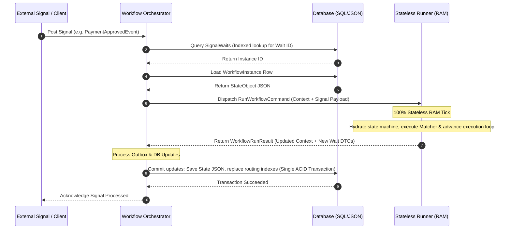

# 🏗️ Workflows Engine: Project Summary

A high-performance, lightweight, snapshot-serialized workflow engine for **.NET 10**.

Unlike traditional workflow engines (such as Temporal or Durable Functions) that rely on event-sourcing and expensive replay mechanisms to rebuild execution state, this engine directly serializes the compiler-generated C# state machine state and container properties into JSON. This results in sub-millisecond execution ticks, minimal database overhead, and instant workflow resumption.

---

## 🏛️ Architectural Pillars

The engine is built on a strict separation of **Domain Definition**, **I/O & Persistence**, and **Compute & Execution**, logically decoupled to support scaling from a single-process monolith to a distributed microservice cluster.

```mermaid
graph TD
    subgraph Client API & Hosting
        Client[Workflows.Client] --> Host[Workflows.Hosting.InProcess]
    end

    subgraph I/O & Persistence (Stateful)
        Orch[Workflows.Orchestrator] --> DB[(Database / EF Core)]
    end

    subgraph Compute & Execution (Stateless)
        Runner[Workflows.Runner]
        Defs[Workflows.Definition]
    end

    Client -- Signals/Commands --> Orch
    Orch -- Hydrated Context --> Runner
    Runner -- State Machine Tick --> Runner
    Runner -- Wait DTOs & New State --> Orch
    Orch -- Commit SQL Index & JSON Blob --> DB
```

### 1. [Workflows.Definition](file:///d:/MySrc/Workflows/Workflows.Definition/Workflows.Definition.csproj) (DSL Layer)
*   **Responsibility**: Defines a zero-dependency, fluent Domain Specific Language (DSL) for authoring workflows.
*   **Key Concept**: Developers inherit from [WorkflowContainer](file:///d:/MySrc/Workflows/Workflows.Definition/WorkflowContainer-Base.cs) and return `IAsyncEnumerable<Wait>` using native C# `yield return` statements for control flow.
*   **Wait Primitives**: Provides core suspension nodes: `WaitSignal`, `WaitDelay` (Timers), `WaitGroup` (Parallel branching/MatchAny/MatchAll), `WaitSubWorkflow` (Recursive child execution), and Saga compensations.
*   **Clean Abstraction**: Infrastructure-specific DTOs are kept `internal` and shared with the Runner using `[InternalsVisibleTo]`, keeping the author's IDE workspace clean.

### 2. [Workflows.Orchestrator](file:///d:/MySrc/Workflows/Workflows.Orchestrator/Workflows.Orchestrator.csproj) (I/O & Persistence)
*   **Responsibility**: Act as the transaction coordinator and signal router. It maps incoming signals to instances.
*   **Persistence Strategy**: Implements a **Hybrid Document-Relational Model** to balance execution speed and query performance.
*   **State Hydration**: When a signal arrives, the Orchestrator performs a quick SQL index lookup to locate the instance, loads and deserializes its JSON state, and dispatches it to the stateless Runner.

### 3. [Workflows.Runner](file:///d:/MySrc/Workflows/Workflows.Runner/Workflows.Runner.csproj) (Compute & Execution)
*   **Responsibility**: The stateless "brain" of the engine. It handles compiler state machine progression, C# expression tree parsing, and delegate evaluation.
*   **Stateless execution**: It does not touch databases or I/O. It consumes execution requests, runs in-memory ticks, and returns updated context snapshots and wait DTOs.
*   **Optimized Hot Paths**: Memory-caches compiled delegates to avoid reflection costs on repeat runs.

### 4. [Workflows.Abstraction](file:///d:/MySrc/Workflows/Workflows.Abstraction/Workflows.Abstraction.csproj) & [Workflows.Communication.Abstraction](file:///d:/MySrc/Workflows/Workflows.Communication.Abstraction/Workflows.Communication.Abstraction.csproj)
*   **Responsibility**: The decoupling boundaries of the engine. Defines transports (`IMessageTransport`, `IMessageSubscriber`, `IMessageDispatcher`) so the Orchestrator and Runner can communicate either in-process or over RabbitMQ/Kafka.

---

## 💾 The Storage Layer (Hybrid Document-Relational)

To achieve sub-millisecond routing and avoid full-table scans of JSON blobs, the persistence layer separates the **Source of Truth** from the **Routing Indexes**.

### 1. The Aggregate Root (`WorkflowInstances` Table)
Stores the entire execution context in a single, versioned database row containing a serialized JSON blob.
*   `Id` (Guid, PK)
*   `Status` (Enum: `Running`, `Completed`, `InError`)
*   `StateObject` (JSON/JSONB): The serialized `WorkflowRunContext` containing local variables, current state machine index, and the wait tree.

### 2. The Indexing Tables
Flat relational tables index active waits to support fast, direct lookups when signals or callbacks arrive.

| Index Table | Purpose | Keys |
| :--- | :--- | :--- |
| `SignalWaits` | Indexes pending signals and delay timers | `WorkflowInstanceId`, `SignalPath` (Indexed) |
| `CommandWaits` | Tracks pending outgoing asynchronous commands | `WorkflowInstanceId`, `CommandWaitId` |
| `CompensationWaits` | Indexes Saga undo/rollback operations | `WorkflowInstanceId`, `CompensationWaitId` |

---

## 🔄 Engine Execution Lifecycle

When an external signal is received, the system follows this workflow:



---

## ⚡ Performance Optimization: Reflection Elimination

A key enhancement to the engine's throughput was the removal of reflection from the execution hot path. 

> [!TIP]
> During command execution, the Runner previously used reflection (`GetProperty()` and `GetValue()`) to inspect metadata from wait objects, adding **5-10 microseconds** of overhead per command.

### The Solution: Compiled Property Accessors
The engine compiles property getters into native code using expression trees at startup and caches them.
```csharp
private static readonly ConcurrentDictionary<Type, CommandWaitAccessor> _accessorCache = new();

// Compiles expression trees to native code delegates once per command type
private static Func<object, TResult> CompilePropertyGetter<TResult>(Type type, string propertyName)
{
    var parameter = Expression.Parameter(typeof(object), "instance");
    var convert = Expression.Convert(parameter, type);
    var property = Expression.Property(convert, propertyName);
    var convertResult = Expression.Convert(property, typeof(TResult));
    return Expression.Lambda<Func<object, TResult>>(convertResult, parameter).CompileFast();
}
```

### Performance Impact:
*   **Property Access**: Reduced from ~500ns to **~15ns** (a **33x speedup**).
*   **Throughput**: Saved ~14.5ms of CPU overhead per 10,000 commands.

---

## 💻 Workflow Example: Order Processing

This example demonstrates how a workflow is authored. It highlights the **Explicit State Hand-off Pattern** (passing local variables into lambda expressions via `.WithState(...)`) which prevents C# compiler closures from introducing execution and serialization overhead.

```csharp
using Workflows.Definition;

[Workflow("OrderProcessingWorkflow", 1)]
public sealed partial class OrderProcessingWorkflow : WorkflowContainer
{
    // These properties are automatically serialized in the JSON state snapshot
    public int CurrentOrderId { get; set; }
    public string CurrentCustomer { get; set; } = string.Empty;

    public async IAsyncEnumerable<Wait> Run(OrderProcessingState state)
    {
        // 1. Wait for an Order Submitted signal
        yield return WaitSignal<OrderSubmittedEvent>("OrderSubmittedSignal", "Wait for Order Submission")
            .WithState(state.MinOrderId) // Explicit state avoids closure allocation
            .MatchIf((order, minId) => order.OrderId > minId)
            .AfterMatch((order) =>
            {
                CurrentOrderId = order.OrderId;
                CurrentCustomer = order.CustomerName;
            });

        // 2. Wait for a specific duration (Timer)
        yield return WaitDelay(TimeSpan.FromMinutes(5), "Grace period before charging");

        // 3. Execute a Command (Immediate Mode - completes in the same transaction)
        yield return ExecuteCommand(new ChargePaymentCommand(CurrentOrderId), CommandExecutionMode.Immediate);

        // 4. Wait for Parallel Fulfillment Events
        yield return WaitGroup([
            WaitSignal<ShippingEvent>("InventoryAllocated").WithState(CurrentOrderId).MatchIf((e, id) => e.OrderId == id),
            WaitSignal<ShippingEvent>("LabelPrinted").WithState(CurrentOrderId).MatchIf((e, id) => e.OrderId == id)
        ], "Fulfillment Preparation");

        // 5. Execute recursive child workflow
        yield return WaitSubWorkflow(ShippingSubWorkflow(), "Execute Shipping Sub-Workflow");

        Console.WriteLine($"Order {CurrentOrderId} for {CurrentCustomer} fully processed!");
    }
}
```

---

## 📂 Codebase Directory Map

The solution is divided into the following project modules:

| Directory / Project | Layer | Purpose |
| :--- | :--- | :--- |
| **[`Workflows.sln`](file:///d:/MySrc/Workflows/Workflows.sln)** | Root Solution | Houses all code modules and samples. |
| **[`Workflows.Definition/`](file:///d:/MySrc/Workflows/Workflows.Definition/Workflows.Definition.csproj)** | DSL | Declarative primitives, fluent builders, and scan registration. |
| **[`Workflows.Runner/`](file:///d:/MySrc/Workflows/Workflows.Runner/Workflows.Runner.csproj)** | Compute | Stateful compiler wrapper, state advancer, and expression matchers. |
| **[`Workflows.Orchestrator/`](file:///d:/MySrc/Workflows/Workflows.Orchestrator/Workflows.Orchestrator.csproj)** | Persistence | Coordinate transactions, query indexes, trigger timers, schedule tasks. |
| **[`Workflows.Abstraction/`](file:///d:/MySrc/Workflows/Workflows.Abstraction/Workflows.Abstraction.csproj)** | Interfaces | Shared interfaces, DTOs, and persistence abstractions. |
| **[`Workflows.Communication.Abstraction/`](file:///d:/MySrc/Workflows/Workflows.Communication.Abstraction/Workflows.Communication.Abstraction.csproj)** | Messaging | Interface decoupling client, runner, and orchestrator boundaries. |
| **[`DataStore/Workflows.Storage.Sqlite/`](file:///d:/MySrc/Workflows/DataStore/Workflows.Storage.Sqlite/Workflows.Storage.Sqlite.csproj)** | Storage Provider | SQLite dialect and EF Core mappings. |
| **[`DataStore/Workflows.Storage.Postgres/`](file:///d:/MySrc/Workflows/DataStore/Workflows.Storage.Postgres/Workflows.Storage.Postgres.csproj)** | Storage Provider | Postgres dialect with JSONB column optimization. |
| **[`Hosting/Workflows.Hosting.InProcess/`](file:///d:/MySrc/Workflows/Hosting/Workflows.Hosting.InProcess/Workflows.Hosting.InProcess.csproj)** | Host | In-memory runner client and host setup for monoliths. |
| **[`Samples/InProcessSqliteSample/`](file:///d:/MySrc/Workflows/Samples/InProcessSqliteSample/InProcessSqliteSample.csproj)** | Sample | Interactive CLI database monitoring dashboard. |
| **[`Samples/WorkflowSample/`](file:///d:/MySrc/Workflows/Samples/WorkflowSample/WorkflowSample.csproj)** | Sample | CLI sandbox with example workflow templates. |
