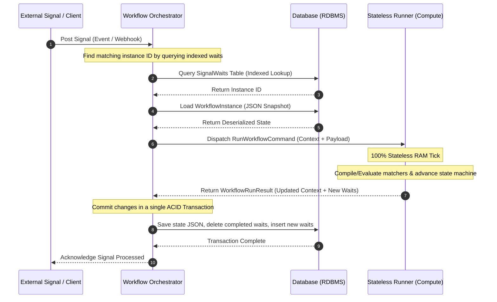

# 🏗️ Workflows Engine

[](https://dotnet.microsoft.com/download)
[](LICENSE)
[](#)

A high-performance, lightweight, snapshot-serialized workflow engine for **.NET**. 

Unlike traditional workflow engines (e.g., Temporal or Durable Functions) that rely on event-sourcing and expensive replay mechanisms to rebuild execution state, this engine directly serializes the compiler-generated C# state machine state and container properties into JSON. This results in sub-millisecond execution ticks, minimal database overhead, and instant workflow resumption.

---

## 🚀 Key Features

*   **No Replay Overhead:** Workflows are suspended and serialized as complete execution snapshots. Resuming execution requires a single key-value database lookup and instant deserialization—no event replay necessary.
*   **Pure C# Domain DSL:** Author workflows using standard C# control flow and native `IAsyncEnumerable<Wait>` generators with `yield return` statements. Workflow definitions remain 100% database and infrastructure-agnostic.
*   **Stateless Compute (Runner):** The **Runner** contains zero database/I/O connections. It acts as a pure in-memory compute brain, executing in-process via high-performance `System.Threading.Channels` (`WorkflowExecutionChannel`) inside the host application, and utilizing dynamic delegate compilation to eliminate reflection bottlenecks.
*   **ACID Persistence (Orchestrator):** The **Orchestrator** manages all state persistence using a **Hybrid Document-Relational Model**. Relational tables index active waits for sub-millisecond signal routing, while execution context blobs are saved in a single document column.
*   **Embedded In-Process Engine:** By default, the Orchestrator and Runner run in-process as a single unified unit for ease of hosting and operations. They are logically decoupled via transport-agnostic interfaces but communicate with zero-network overhead using an in-memory loopback transport.
*   **Advanced Control Flow:** Built-in support for `WaitSignal`, `WaitDelay` (Timers), `WaitGroup` (Parallel branching/MatchAny/MatchAll), `WaitSubWorkflow` (Recursive child workflows), and Saga compensations.

---

## 🏛️ Architecture Overview

The engine is built on a strict separation of **Domain Definition**, **I/O & Persistence**, and **Compute & Execution**.



> [!NOTE]
> In the embedded engine implementation, the communication between the **Workflow Orchestrator** and **Stateless Runner** (Steps 7 and 9 in the diagram above) is mediated via high-performance, in-memory `System.Threading.Channels` (`WorkflowExecutionChannel`) without network overhead.

For a detailed look into each layer, explore the project documentation:
*   [Architectural Reference Guide](_Documents/Architecture/Architectural%20Reference%20Guide.md)
*   [Runner Evaluation Logic](_Documents/Architecture/Runner%20Evaluation%20Logic.md)
*   [Hybrid Storage Architecture](_Documents/Architecture/Workflow%20Engine%20Storage%20Architecture.md)

---

## 📦 Project Structure

```
├── Workflows.sln                        # Visual Studio Solution
├── Workflows.Definition/                # Pure DSL, WorkflowContainer, and wait primitives
├── Workflows.Orchestrator/              # Database interaction, scheduling, and transaction handling
├── Workflows.Runner/                    # Stateless state machine advancer and expression tree matchers
├── Workflows.Client/                    # Client API for initiating and signaling workflows
├── Workflows.Common/                    # Shared interfaces, JSON serializers, and general utilities
├── Workflows.Hosting.InProcess/         # Simple in-memory hosting setup for mono-process applications
├── Samples/
│   ├── InProcessSqliteSample/           # Interactive CLI checkout dashboard (SQLites)
│   └── WorkflowSample/                  # CLI sandbox with various basic workflows
└── _Documents/                          # In-depth design docs and architecture reference guides
```

---

## 💻 Writing a Workflow

Workflows are authored by inheriting from `WorkflowContainer` and returning `IAsyncEnumerable<Wait>`.

```csharp
using Workflows.Definition;

[Workflow("OrderProcessingWorkflow", 1)]
public sealed partial class OrderProcessingWorkflow : WorkflowContainer
{
    // Domain properties are automatically serialized and restored
    public int CurrentOrderId { get; set; }
    public string CurrentCustomer { get; set; } = string.Empty;

    public async IAsyncEnumerable<Wait> Run(OrderProcessingState state)
    {
        // 1. Wait for an external Order Submitted event
        yield return WaitSignal<OrderSubmittedEvent>("OrderSubmittedSignal", "Wait for Order Submission")
            .WithState(state.MinOrderId) // Explicit state passing avoids closure performance penalties
            .MatchIf((order, minId) => order.OrderId > minId)
            .AfterMatch((order) =>
            {
                CurrentOrderId = order.OrderId;
                CurrentCustomer = order.CustomerName;
            });

        // 2. Wait for a specific duration
        yield return WaitDelay(TimeSpan.FromMinutes(5), "Grace period before payment charging");

        // 3. Wait for payment signal matching this specific Order ID
        yield return WaitSignal<PaymentProcessedEvent>("PaymentProcessedSignal", "Wait for Payment")
            .WithState(CurrentOrderId)
            .MatchIf((payment, orderId) => payment.OrderId == orderId)
            .AfterMatch((payment, orderId) =>
            {
                Console.WriteLine($"Payment processed: {payment.IsSuccessful}");
            });

        // 4. Parallel execution wait group
        yield return WaitGroup([
            WaitSignal<ShippingEvent>("InventoryAllocated", "Wait for Inventory").WithState(CurrentOrderId).MatchIf((e, id) => e.OrderId == id),
            WaitSignal<ShippingEvent>("LabelPrinted", "Wait for Label").WithState(CurrentOrderId).MatchIf((e, id) => e.OrderId == id)
        ], "Parallel Fulfillment Preparation");

        // 5. Invoke a Sub-Workflow
        yield return WaitSubWorkflow(ShippingSubWorkflow(), "Execute Shipping Sub-Workflow");

        Console.WriteLine($"Order {CurrentOrderId} for {CurrentCustomer} fully processed!");
    }
}
```

---

## 💾 The Storage Layer

To allow rapid queries without parsing huge JSON structures, the engine uses a **Hybrid Document-Relational Model**:

### 1. The Aggregate Root (`WorkflowInstances` Table)
Stores the entire execution context in a single, versioned database row containing a serialized JSON/JSONB blob.
*   `Id` (Guid, PK)
*   `WorkflowRegistrationId` (Guid, FK)
*   `Status` (Enum)
*   `StateObject` (JSON) — **Source of truth.** Serializes variables, call stack, and current state machine step.

### 2. The Indexing Tables (`SignalWaits` / `CommandWaits` Tables)
Flat, relational tables containing ONLY the information needed to route incoming events.
*   `Id` (Guid, PK)
*   `WorkflowInstanceId` (Guid, FK)
*   `Path` / `MatchId` (String, Indexed) — Used for fast index matches (e.g. `OrderProcessingWorkflow_12345`).

---

## 🛠️ Getting Started

### Prerequisites
*   [.NET 10.0 SDK](https://dotnet.microsoft.com/download)

### Run the Interactive Demo
The repository contains a fully featured, interactive console application that spins up the orchestrator, runner, background scheduler, and a SQLite database provider entirely in-process.

Run the SQLite demo:
```bash
dotnet run --project Samples/InProcessSqliteSample/InProcessSqliteSample.csproj
```

Using the CLI dashboard, you can:
1.  **Launch** new order workflows.
2.  **Inspect** active SQLite wait index tables (`SignalWaitEntity`, `CommandWaitEntity`) in real-time.
3.  **Dispatch** custom signals (e.g., inventory allocation, customer verification) to advance workflows.
4.  **Simulate** external asynchronous tasks (e.g. payment auth, shipping delivery) and feedback their results.
5.  **Review** execution logs and serialized domain variables step-by-step.
