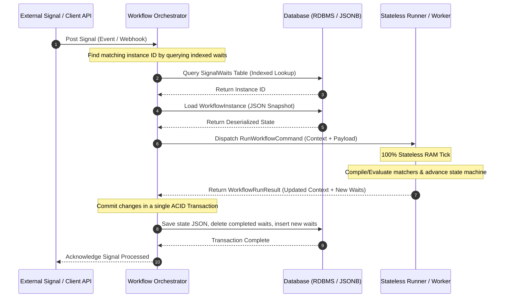

# 🏗️ Workflows Engine

[](https://dotnet.microsoft.com/download)
[](LICENSE)
[](#)

A high-performance, lightweight, snapshot-serialized workflow engine for **.NET 10**.

Unlike traditional workflow engines (e.g., Temporal or Durable Functions) that rely on event-sourcing and expensive replay mechanisms to rebuild execution state, this engine directly serializes compiler-generated C# state machine states and container properties into JSON. This results in sub-millisecond execution ticks, minimal database overhead, and instant workflow resumption.

---

## 🚀 Key Features

* **No Replay Overhead:** Workflows are suspended and serialized as complete execution snapshots. Resuming execution requires a single key-value database lookup and instant deserialization—no event replay necessary.
* **Pure C# Domain DSL:** Author workflows using standard C# control flow and native `IAsyncEnumerable<Wait>` generators with `yield return` statements. Workflow definitions remain 100% database and infrastructure-agnostic.
* **Stateless Compute (Runner):** The **Runner** contains zero database/I/O connections. It acts as a pure in-memory compute brain, executing in-process via high-performance `System.Threading.Channels` (`WorkflowExecutionChannel`), or out-of-process via IPC. Dynamic delegate compilation eliminates reflection bottlenecks.
* **ACID Persistence (Orchestrator):** The **Orchestrator** manages all state persistence using a **Hybrid Document-Relational Model**. Relational tables index active waits for sub-millisecond signal routing, while execution context blobs are saved in a single document column.
* **Out-of-Process Worker Supervision:** Multi-version Side-by-Side (SxS) execution support via `WorkerProcessSupervisor`, launching isolated worker sub-processes managed via high-performance Named Pipe IPC.
* **Roslyn Static Analysis (`Workflows.Analyzers`):** Compilation-time diagnostics enforcing engine constraints—preventing scope closure variable captures, unsealed workflow containers, and unsafe runtime references.
* **CLI Tooling Suite (`dotnet-wf`):** Command-line utility for offline contract schema extraction, automated breaking change verification gates, pre-publish deployment manifests, and C# migration boilerplate generation.
* **Embedded ASP.NET Core Admin Dashboard (`Workflows.Admin.UI`):** Full-featured monitoring dashboard with visual DAG topology network graphs (vis-network), step trace timelines, JSON variable state inspection, and live workflow signal/cancellation controls.
* **Multiple Transport & Storage Providers:** Support for SQLite, PostgreSQL (with native JSONB optimization), Microsoft SQL Server, EF Core, gRPC streaming, and HTTP WebAPI transports.

---

## 🏛️ Architecture Overview

The engine is built on a strict separation of **Domain Definition**, **I/O & Persistence**, and **Compute & Execution**.



> [!NOTE]
> In embedded engine hosting, communication between Orchestrator and Runner is mediated via high-performance in-memory `System.Threading.Channels` (`WorkflowExecutionChannel`). In distributed or side-by-side deployment, execution is dispatched to isolated out-of-process workers over Named Pipe IPC or gRPC transport.

For a detailed look into each layer, explore the project documentation:
* [Architectural Reference Guide](_Documents/Architecture/Architectural%20Reference%20Guide.md)
* [Runner Evaluation Logic](_Documents/Architecture/Runner%20Evaluation%20Logic.md)
* [Hybrid Storage Architecture](_Documents/Architecture/Workflow%20Engine%20Storage%20Architecture.md)
* [Out-of-Process Worker Architecture](_Documents/Roadmap/Versioning/Out-of-Process%20Worker%20Supervisor%20Architecture.md)

---

## 📦 Project Structure

The repository contains 26 modular projects organized into clear functional layers:

| Layer / Directory | Project Name | Description |
| :--- | :--- | :--- |
| **Core Primitives** | [`Workflows.Primitives`](Workflows.Primitives/Workflows.Primitives.csproj) | Fundamental state and wait DTO data structures. |
| | [`Workflows.Abstraction`](Workflows.Abstraction/Workflows.Abstraction.csproj) | Core interfaces for orchestrators, runners, and storage repositories. |
| | [`Workflows.Communication.Abstraction`](Workflows.Communication.Abstraction/Workflows.Communication.Abstraction.csproj) | Decoupled message transport and subscriber contracts. |
| | [`Workflows.Definition`](Workflows.Definition/Workflows.Definition.csproj) | Authoring DSL (`WorkflowContainer`, `WaitSignal`, `WaitDelay`, `WaitGroup`). |
| | [`Workflows.Common.Abstraction`](Workflows.Common.Abstraction/Workflows.Common.Abstraction.csproj) | Shared serialization and expression transformation interfaces. |
| | [`Workflows.Common`](Workflows.Common/Workflows.Shared.csproj) | Expression serialization (Nuqleon Bonsai), `System.Text.Json` helpers, DI utilities. |
| **Runtime & Host** | [`Workflows.Runner`](Workflows.Runner/Workflows.Runner.csproj) | Stateless state machine advancer and dynamic matcher compiler. |
| | [`Workflows.Orchestrator`](Workflows.Orchestrator/Workflows.Orchestrator.csproj) | Persistence coordinator, timer scheduler, and signal router. |
| | [`Workflows.Hosting.InProcess`](Hosting/Workflows.Hosting.InProcess/Workflows.Hosting.InProcess.csproj) | Mono-process bootstrapper combining Orchestrator, SQLite, and Runner. |
| **Client Transports** | [`Workflows.Client`](Workflows.Client/Workflows.Client/Workflows.Client.csproj) | Client SDK for posting signals and executing deferred commands. |
| | [`Workflows.Client.gRPC`](Workflows.Client/Workflows.Client.gRPC/Workflows.Client.gRPC.csproj) | High-performance gRPC streaming transport for distributed nodes. |
| | [`Workflows.Client.WebApi`](Workflows.Client/Workflows.Client.WebApi/Workflows.Client.WebApi.csproj) | HTTP WebAPI endpoints and transport client. |
| **Storage Adapters** | [`Workflows.Storage.EntityFrameworkCore`](DataStore/Workflows.Storage.EntityFrameworkCore/Workflows.Storage.EntityFrameworkCore.csproj) | Primary EF Core DbContext (`WorkflowsDbContext`) and TPH entity mappings. |
| | [`Workflows.Storage.Sqlite`](DataStore/Workflows.Storage.Sqlite/Workflows.Storage.Sqlite.csproj) | SQLite database provider adapter. |
| | [`Workflows.Storage.Postgres`](DataStore/Workflows.Storage.Postgres/Workflows.Storage.Postgres.csproj) | PostgreSQL provider adapter with native JSONB optimization. |
| | [`Workflows.Storage.SqlServer`](DataStore/Workflows.Storage.SqlServer/Workflows.Storage.SqlServer.csproj) | Microsoft SQL Server provider adapter. |
| **Admin & Tools** | [`Workflows.Admin.UI`](Workflows.Admin.UI/Workflows.Admin.UI.csproj) | Embedded ASP.NET Core MVC administration dashboard & visual DAG topology viewer. |
| | [`Workflows.Tools.CLI`](Workflows.Tools.CLI/Workflows.Tools.CLI.csproj) | `dotnet-wf` CLI tool for schema export, drift verification, and migration generation. |
| | [`Workflows.Analyzers`](Workflows.Analyzers/Workflows.Analyzers.csproj) | Roslyn static code analyzer preventing closure captures and engine rule violations. |
| **Samples & Testing**| [`Samples/InProcessSqliteSample`](Samples/InProcessSqliteSample/InProcessSqliteSample.csproj) | Interactive CLI checkout dashboard running on SQLite. |
| | [`Samples/Workflows.Admin.UI.Sample`](Samples/Workflows.Admin.UI.Sample/Workflows.Admin.UI.Sample.csproj) | Complete ASP.NET Core host embedding the Admin Web UI dashboard. |
| | [`Samples/OutOfProcessWorkerSample`](Samples/OutOfProcessWorkerSample/OutOfProcessWorkerSample.csproj) | Out-of-process worker process supervisor & `dotnet-wf` CLI demonstration. |
| | [`Samples/WorkflowSample`](Samples/WorkflowSample/WorkflowSample.csproj) | CLI sandbox with example workflow definitions. |
| | [`Tests/Workflows.Runner.Tests`](Tests/Workflows.Runner.Tests/Workflows.Runner.Tests.csproj) | Main unit and integration test suite. |
| | [`Workflows.Runner.TestShell`](Workflows.Runner.TestShell/Workflows.Runner.TestShell.csproj) | Test shell helper harness for runner verification. |
| | [`Tests/TestSomething`](Tests/TestSomething/TestSomething.csproj) | Experimental scratch test host. |

---

## 💻 Writing a Workflow

Workflows are authored by inheriting from `WorkflowContainer` and returning `IAsyncEnumerable<Wait>`.

```csharp
using Workflows.Definition;

[Workflow("OrderProcessingWorkflow", 1)]
public sealed partial class OrderProcessingWorkflow : WorkflowContainer
{
    // Domain properties are automatically serialized and restored
    public int CurrentOrderId { get; set; }
    public string CurrentCustomer { get; set; } = string.Empty;

    public async IAsyncEnumerable<Wait> Run(OrderProcessingState state)
    {
        // 1. Wait for an external Order Submitted event
        yield return WaitSignal<OrderSubmittedEvent>("OrderSubmittedSignal", "Wait for Order Submission")
            .WithState(state.MinOrderId) // Explicit state passing avoids closure allocations
            .MatchIf((order, minId) => order.OrderId > minId)
            .AfterMatch((order) =>
            {
                CurrentOrderId = order.OrderId;
                CurrentCustomer = order.CustomerName;
            });

        // 2. Wait for a specific duration
        yield return WaitDelay(TimeSpan.FromMinutes(5), "Grace period before payment charging");

        // 3. Wait for payment signal matching this specific Order ID
        yield return WaitSignal<PaymentProcessedEvent>("PaymentProcessedSignal", "Wait for Payment")
            .WithState(CurrentOrderId)
            .MatchIf((payment, orderId) => payment.OrderId == orderId)
            .AfterMatch((payment, orderId) =>
            {
                Console.WriteLine($"Payment processed: {payment.IsSuccessful}");
            });

        // 4. Parallel execution wait group
        yield return WaitGroup([
            WaitSignal<ShippingEvent>("InventoryAllocated", "Wait for Inventory").WithState(CurrentOrderId).MatchIf((e, id) => e.OrderId == id),
            WaitSignal<ShippingEvent>("LabelPrinted", "Wait for Label").WithState(CurrentOrderId).MatchIf((e, id) => e.OrderId == id)
        ], "Parallel Fulfillment Preparation");

        // 5. Invoke a Sub-Workflow
        yield return WaitSubWorkflow(ShippingSubWorkflow(), "Execute Shipping Sub-Workflow");

        Console.WriteLine($"Order {CurrentOrderId} for {CurrentCustomer} fully processed!");
    }
}
```

---

## 🛠️ CLI Suite (`dotnet-wf`)

The engine includes `dotnet-wf` (`Workflows.Tools.CLI`) for CI/CD and developer workflows:

```bash
# Extract contract schemas from workflow assembly
dotnet wf schema --assembly "./bin/Release/net10.0/OrderWorkflows.dll" --out "./_Schemas"

# Verify schema compatibility gate in CI/CD pipeline (exits 1 on breaking drift)
dotnet wf verify --old "./bin/V1/OrderWorkflows.dll" --new "./bin/V2/OrderWorkflows.dll"

# Generate deployment manifest for worker supervisor
dotnet wf compare --old "./bin/V1/Workflows.dll" --new "./bin/V2/Workflows.dll" --out "./Publish"

# Generate strongly-typed C# WorkflowMigration boilerplate
dotnet wf migrate --workflow "OrderProcessingWorkflow" --from 1 --to 2 --out "./Migrations"
```

---

## 🛠️ Getting Started & Demos

### Prerequisites
* [.NET 10.0 SDK](https://dotnet.microsoft.com/download)

### 1. Run the Interactive SQLite CLI Demo
```bash
dotnet run --project Samples/InProcessSqliteSample/InProcessSqliteSample.csproj
```
Interactive terminal dashboard to launch workflows, inspect active SQLite wait tables (`SignalWaitEntity`, `CommandWaitEntity`), dispatch signals, and track logs.

### 2. Run the Embedded Admin Web UI Demo
```bash
dotnet run --project Samples/Workflows.Admin.UI.Sample/Workflows.Admin.UI.Sample.csproj
```
Starts an ASP.NET Core server hosting the Admin UI at `http://localhost:5000/admin`. Explore active instances, visual DAG network graphs, step trace timelines, and live signal dispatching.

### 3. Run the Out-of-Process Worker & CLI Demo
```bash
dotnet run --project Samples/OutOfProcessWorkerSample/OutOfProcessWorkerSample.csproj
```
Demonstrates spawning isolated out-of-process worker sub-processes managed over Named Pipe IPC, sending IPC commands, and executing `dotnet-wf` schema/manifest extraction.

---

## 📚 Documentation & Reference Index

- 📘 [Project Summary Sheet](_Documents/PROJECT_SUMMARY.md)
- 📘 [Project Dependency Graph](_Documents/ProjectDependencies.md)
- 📘 [Wiki Documentation](Workflows.wiki/Home.md)
- 📘 [HowTo & Migration Guides](_Documents/HowTo/index.md)
- 📘 [Admin Web UI Overview](Workflows.Admin.UI/README.md)
- 📘 [CLI Tool Suite Reference](Workflows.Tools.CLI/README.md)
- 📘 [Roslyn Analyzers Guide](Workflows.Analyzers/README.md)
