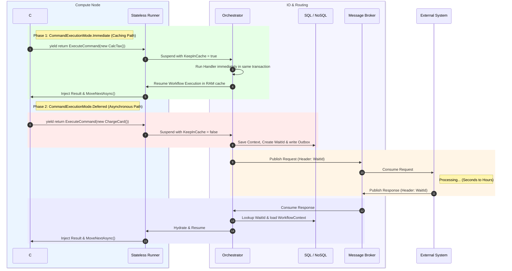

# Architecture Guide: Command Execution Modes

The `CommandExecutionMode` dictates how a command's execution and result are handled by the Runner and Orchestrator. Regardless of the mode, all command yields suspend the Runner's in-memory C# execution loop to permit persistence, outbox message queuing, and proper tracking.

The two execution modes are:
1. **`CommandExecutionMode.Immediate`** (Fast/In-Memory Caching Path)
2. **`CommandExecutionMode.Deferred`** (Asynchronous/Out-of-Process Path)

---

## 1. `CommandExecutionMode.Immediate` (The Caching Path)
**Use Case:** Internal calculations, local state updates, fast synchronous validations, or database writes where the workflow wants to execute the handler immediately but keep the context hot in memory for consecutive steps.

**The Philosophy:** Although immediate commands suspend the C# execution loop to allow the orchestrator to orchestrate transactions, the workflow container does not need to be unloaded from memory. The Runner indicates that it should keep the instance context in cache.

### Step-by-Step Lifecycle (`Immediate`)
1. **Yield:** The C# workflow yields `yield return ExecuteCommand(new CalculateTaxCommand(), CommandExecutionMode.Immediate)`.
2. **Serialization & Suspension:** The Runner maps the yielded `CommandWait` to a `CommandWaitDto`. The `CommandSerializer` marks `KeepInCache = true` and suspends the execution loop (`ContinueExecutionLoop = false`).
3. **Orchestrator Execution:** The Orchestrator receives the execution response, identifies the command mode as `Immediate`, and invokes the local `ICommandHandler` immediately in the same transaction block.
4. **Immediate Resumption:** The Orchestrator calls `ProcessCommandResultAsync` with the result. Since the instance is still flagged to be kept in cache, the Runner processes the next step without incurring state loading and deserialization overhead.

*Result: Immediate execution with minimal caching overhead.*

---

## 2. `CommandExecutionMode.Deferred` (The Asynchronous Path)
**Use Case:** External API calls (e.g., Stripe, SendGrid), long-running microservice tasks, or any interaction where the workflow must send a message and wait for an asynchronous reply.

**The Philosophy:** The Runner is a pure compute unit; it should never block thread execution waiting for external systems. If a command requires a remote callback, the Runner suspends execution, unloads the state from cache, and lets the Orchestrator handle asynchronous dispatching.

### Step-by-Step Lifecycle (`Deferred`)

#### Phase A: Suspension (Compute -> IO)
1. **Yield:** The workflow yields `yield return ExecuteCommand(new ChargeCreditCardCommand(), CommandExecutionMode.Deferred)`.
2. **Runner Halts:** The Runner serializes the wait. `CommandSerializer` sets `KeepInCache = false` and breaks the run loop. It packages the state snapshot and DTOs, returning them to the Orchestrator.
3. **Persistence:** The Orchestrator commits the updated state snapshot to the document store and inserts the `CommandWait` metadata into the SQL database, generating a unique `WaitId`.

#### Phase B: Dispatch & Execution
4. **Outbox/Message Broker:** The Orchestrator pushes the `ChargeCreditCardCommand` into the Outbox table. A background dispatcher picks it up and publishes it to RabbitMQ/Kafka.
5. **External Processing:** The external microservice processes the request and returns a `ChargeCardResult` containing the correlation `WaitId`.

#### Phase C: Resumption
6. **Lookup:** The Orchestrator receives the result and runs a fast SQL lookup by `WaitId` to find the corresponding `WorkflowInstanceId`.
7. **Wake Up:** The Orchestrator loads the sleeping state snapshot from the document store and dispatches it along with the result payload to an available Runner.
8. **Hydration:** The Runner hydrates the state, feeds the result into the workflow container, and resumes execution.

---

### Summary Checklist for Workflow Authors
* If it **completes instantly** (e.g., local DB write, calculations, logging) ➔ Use **`CommandExecutionMode.Immediate`**.
* If it **talks to external systems or queues** (e.g., remote microservices, external APIs) ➔ Use **`CommandExecutionMode.Deferred`**.

---

### Comparison of Options

```csharp
// Option A: Direct C# Method Call (Invisible to Engine)
var tax = CalculateTax(orderAmount);

// Option B: Engine Command (CommandExecutionMode.Immediate)
yield return ExecuteCommand(new CalculateTaxCommand(orderAmount), CommandExecutionMode.Immediate);
```

1. **Observability & Auditing:** Option A is invisible to the engine. Option B serializes the command and results, preserving a perfect step-by-step history of inputs and outputs in the database.
2. **Saga Tracking & Compensation:** The Runner tracks completed commands by their tokens. Option B allows the engine to automatically execute corresponding rollback/undo delegates if a workflow fails later and calls `Compensate`.
3. **Engine Middleware:** Option B allows applying engine-level policies like retries and error handling configurations.
4. **Dependency Injection:** Option B keeps the workflow decoupled from concrete service implementation details by yielding a POCO that is routed to the corresponding handler by the engine's handler resolver.

