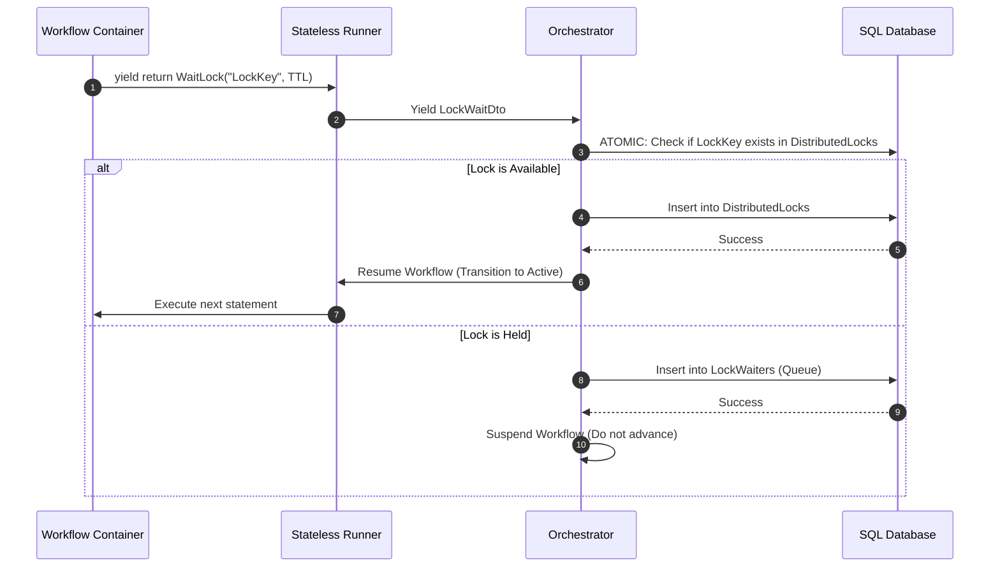

# Distributed Lock Registry: Inter-Instance Mutual Exclusion

This document specifies the design for a **Distributed Lock Registry** inside the Workflows engine, enabling workflow instances to coordinate exclusive access to shared external resources.

---

## 1. Problem Statement

Different workflow instances running concurrently often need to interact with the same external entity (e.g., updating a customer ledger, processing a shipping container, or modifying a specific database row). If multiple instances execute these actions in parallel, race conditions and data inconsistency can occur.

---

## 2. DSL Syntax (Developer Experience)

Developers acquire and release locks using the fluent wait DSL.

### Basic Lock Acquisition
```csharp
yield return WaitLock("CustomerLock_12345", TimeSpan.FromMinutes(10), "Acquire Lock for Customer 12345")
    .OnAcquired(() => 
    {
        Console.WriteLine("Lock successfully acquired!");
    })
    .OnTimeout(() => 
    {
        Console.WriteLine("Could not acquire lock in time.");
    });

// Critical Section: Exclusive actions here
yield return ExecuteCommand(new UpdateCustomerLedgerCommand(12345), CommandExecutionMode.Immediate);

// Release Lock
yield return ReleaseLock("CustomerLock_12345");
```

---

## 3. Database Schema

The Orchestrator coordinates locking using a central database index table, ensuring lock safety across clustered runner nodes.

### The `DistributedLocks` Table
| Column | Type | Description |
| :--- | :--- | :--- |
| **LockKey** | String (PK) | Unique identifier for the lock (e.g., `CustomerLock_12345`). |
| **WorkflowInstanceId** | Guid (FK) | ID of the workflow instance that currently holds the lock. |
| **AcquiredAt** | DateTimeOffset | Timestamp when the lock was granted. |
| **ExpiresAt** | DateTimeOffset | Absolute timestamp when the lock expires (TTL safety). |

### The `LockWaiters` Table
Tracks blocked instances waiting for the lock to be released (First-In, First-Out queue).
*   `Id` (Guid, PK)
*   `LockKey` (String, Indexed)
*   `WorkflowInstanceId` (Guid, FK)
*   `RequestedAt` (DateTimeOffset)

---

## 4. Execution Lifecycle



### 1. Releasing a Lock
When `ReleaseLock("LockKey")` is processed:
1.  The Orchestrator deletes the lock from `DistributedLocks`.
2.  Queries `LockWaiters` for the next waiter (ordered by `RequestedAt` ASC).
3.  If a waiter is found:
    *   Deletes the waiter row.
    *   Inserts a new row in `DistributedLocks` assigning ownership to the waiter instance.
    *   Sends a resumption signal to wake up the waiter workflow.

### 2. Lock Expiry (TTL / Deadlock Prevention)
A background system worker periodically scans `DistributedLocks` where `ExpiresAt < DateTimeOffset.UtcNow`.
1.  Expiring locks are deleted.
2.  If waiters exist in `LockWaiters`, the lock is granted to the next waiter, and that workflow is resumed.
3.  The original holding workflow instance is flagged with a warning or transitioned to a faulted state if it attempts to execute commands under an expired lease.
