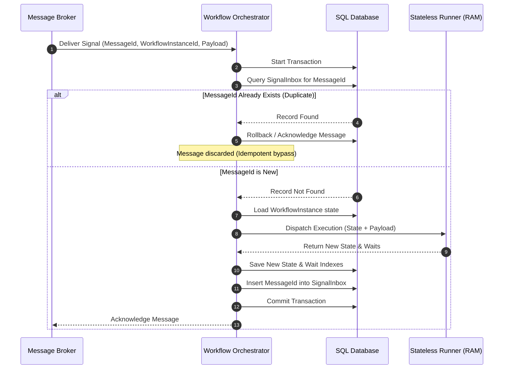

# Idempotent Signal Processing: Event & Signal Deduplication

This document specifies the design for enforcing **idempotence** across incoming signals and command execution results in the Workflows engine.

---

## 1. The Challenge: At-Least-Once Delivery

Modern distributed message queues (e.g., RabbitMQ, Apache Kafka, Azure Service Bus) guarantee **at-least-once** delivery. Network failures, consumer crashes, or broker retries can result in the same signal (e.g., `PaymentApprovedEvent`) being delivered to the Orchestrator multiple times. 

Without deduplication, a workflow instance could evaluate a duplicate signal, advance its state machine twice, or run duplicate side-effects (e.g., shipping a product twice).

---

## 2. Design Strategy: The Inbox Pattern

We implement a database-level **Inbox Pattern** that tracks signal processing history. All signal validations, routing, state updates, and deduplication records are committed within a single, atomic SQL transaction.



---

## 3. Database Schema

The deduplication store resides on the SQL database as the `SignalInbox` table.

### The `SignalInbox` Table
| Column | Type | Description |
| :--- | :--- | :--- |
| **MessageId** | String (PK) | Unique message identifier generated by the producer or broker. |
| **WorkflowInstanceId** | Guid (FK) | Target workflow instance ID. |
| **ProcessedAt** | DateTimeOffset | Timestamp when the message was successfully processed. |
| **PayloadHash** | String | SHA-256 hash of the payload, used for sanity verification. |

---

## 4. Key Management & Expiration (TTL)

To prevent the `SignalInbox` table from growing indefinitely and slowing down lookups, a **sliding expiration window** is applied:

1.  **Retention Window**: Deduplication records are retained for a configurable period (e.g., 7 days) to match broker retry ceilings.
2.  **Pruning**: A background cron worker removes records older than the retention threshold:
    ```sql
    DELETE FROM SignalInbox WHERE ProcessedAt < @ThresholdDate;
    ```

---

## 5. Middleware Integration

The deduplication logic is integrated into the Orchestrator's signal processing pipeline.

```csharp
public class IdempotentSignalProcessor : ISignalProcessor
{
    private readonly ISignalInboxStore _inboxStore;
    private readonly IOrchestrator _orchestrator;

    public async Task ProcessSignalAsync(SignalRequest request)
    {
        // 1. Perform quick out-of-transaction read check (Optimization)
        if (await _inboxStore.HasBeenProcessedAsync(request.MessageId))
        {
            Log.Warning("Duplicate message detected: {MessageId}. Discarding.", request.MessageId);
            return;
        }

        // 2. Route message to Orchestrator (Orchestrator wraps the database transaction)
        await _orchestrator.DeliverSignalIdempotentlyAsync(
            request.MessageId,
            request.InstanceId,
            request.SignalPath,
            request.Payload
        );
    }
}
```
