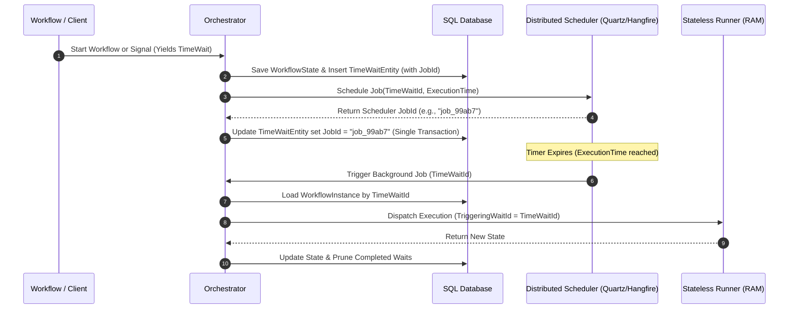

# Orchestrator-Side Distributed Timer Scheduling Design Plan

This document specifies the design and implementation plan for transitioning the Workflows engine from a volatile, in-memory timer scheduler to a persistent, clustered, distributed scheduling subsystem (using Quartz.NET or Hangfire).

---

## 1. Problem Statement & Limitations

The current [Scheduler.cs](file:///d:/MySrc/Workflows/Workflows.Orchestrator/Scheduler.cs) implementation acts as a simple background thread polling an in-memory dictionary. This architecture has critical limitations for production:

*   **Volatility**: Restarting the hosting process wipes out all scheduled timers (`TimeWait` instances), leaving active workflows permanently stuck.
*   **Single-Point Failure**: Cannot scale horizontally. If multiple nodes run the in-memory scheduler, they will lack coordination, leading to duplicate executions or missed timer triggers.
*   **No Persistence**: Timers are decoupled from SQL database transactions, creating a synchronization drift risk between active database waits and in-memory timer records.

---

## 2. Target Architecture

We introduce a persistent scheduler registry backed by a shared SQL database. The system can be configured to use either **Quartz.NET** or **Hangfire** via dependency injection.



---

## 3. Database Schema Modifications

To coordinate cancellation and status tracking, the `TimeWaits` index table is updated to map scheduler job identities.

### `TimeWaits` Table Updates
| Column | Type | Description |
| :--- | :--- | :--- |
| **Id** | Guid (PK) | The unique `TimeWait` identifier generated by the Runner. |
| **WorkflowInstanceId** | Guid (FK) | Owner workflow instance ID. |
| **UniqueMatchId** | String (Index) | The correlation path string (e.g., `OrderProcessingWorkflow_Timer`). |
| **ExecutionTime** | DateTimeOffset | The absolute target UTC timestamp when the timer must expire. |
| **SchedulerJobId** | String (Nullable) | The ID returned by the scheduler framework (e.g., Hangfire Job ID or Quartz Trigger Key) used for cancellation. |

---

## 4. Component-Level Design

### 4.1. The Scheduling Contract (`IExternalScheduler`)
We retain the current interface boundary but expand it to support cancellation.

```csharp
public interface IExternalScheduler
{
    /// <summary>
    /// Schedules a future signal trigger. Returns the unique Job ID.
    /// </summary>
    Task<string> ScheduleSignalAsync(string uniqueMatchId, DateTimeOffset executeAt);

    /// <summary>
    /// Cancels a pending scheduled job.
    /// </summary>
    Task CancelScheduledSignalAsync(string schedulerJobId);
}
```

### 4.2. Scheduling Implementation (Quartz.NET Example)
```csharp
public class QuartzExternalScheduler : IExternalScheduler
{
    private readonly ISchedulerFactory _schedulerFactory;

    public QuartzExternalScheduler(ISchedulerFactory schedulerFactory)
    {
        _schedulerFactory = schedulerFactory;
    }

    public async Task<string> ScheduleSignalAsync(string uniqueMatchId, DateTimeOffset executeAt)
    {
        var scheduler = await _schedulerFactory.GetScheduler();
        var jobId = Guid.NewGuid().ToString();

        var job = JobBuilder.Create<TimerTriggerJob>()
            .WithIdentity(jobId, "WorkflowTimers")
            .UsingJobData("UniqueMatchId", uniqueMatchId)
            .Build();

        var trigger = TriggerBuilder.Create()
            .WithIdentity($"trigger_{jobId}", "WorkflowTimers")
            .StartAt(executeAt)
            .Build();

        await scheduler.ScheduleJob(job, trigger);
        return jobId;
    }

    public async Task CancelScheduledSignalAsync(string schedulerJobId)
    {
        var scheduler = await _schedulerFactory.GetScheduler();
        var jobKey = new JobKey(schedulerJobId, "WorkflowTimers");
        if (await scheduler.CheckExists(jobKey))
        {
            await scheduler.DeleteJob(jobKey);
        }
    }
}
```

### 4.3. The Background Execution Job
The background job triggered by the scheduler is stateless and resolves the orchestrator dynamically to post the signal back into the engine.

```csharp
public class TimerTriggerJob : IJob
{
    private readonly IOrchestrator _orchestrator;

    public TimerTriggerJob(IOrchestrator orchestrator)
    {
        _orchestrator = orchestrator;
    }

    public async Task Execute(IJobExecutionContext context)
    {
        var uniqueMatchId = context.MergedJobDataMap.GetString("UniqueMatchId");
        
        // Timer triggers are modeled as standard signals targeting the unique timer wait path
        await _orchestrator.ProcessSignalAsync(new SignalDto
        {
            Id = Guid.NewGuid(),
            SignalIdentifier = uniqueMatchId,
            Data = null!,
            ClientSentTime = DateTime.UtcNow,
            OrchestratorReceiveTime = DateTime.UtcNow
        });
    }
}
```

---

## 5. Timer Cancellation & Pruning

If a workflow completes early, is cancelled, or if a branch in a `MatchAny` composite group completes, the pending timer waits must be cancelled.

1.  **Detection**: The Runner identifies the cancelled waits and returns their IDs in `ConsumedWaitsIds` or via cancellation payloads.
2.  **Lookup**: The Orchestrator queries `TimeWaits` for the target wait IDs to retrieve their `SchedulerJobId`.
3.  **Unschedule**: The Orchestrator calls `IExternalScheduler.CancelScheduledSignalAsync(schedulerJobId)` to remove the trigger from Quartz/Hangfire.
4.  **SQL Clean-up**: The `TimeWaits` rows are deleted as part of the save transaction.
