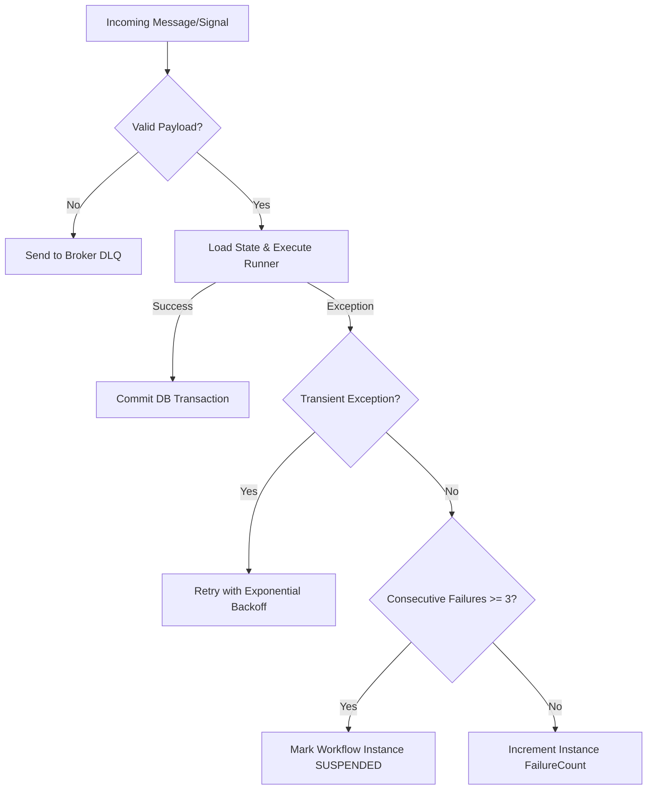

# Poison Message & Dead Letter Queue (DLQ) Handling

This document specifies the design for managing **poison messages** and handling critical workflow execution failures without impacting system throughput or blocking processing queues.

---

## 1. Safety Boundaries

In high-throughput environments, the engine must distinguish between different types of execution failures:

1.  **Transient Faults**: Network timeouts, database lock contentions, or broker reconnects. These are resolved through automatic retries.
2.  **Structural Poison Messages**: Malformed payload JSON, missing headers, or validation failures. Retrying will always fail.
3.  **Application Code Faults**: Unhandled exceptions within a developer's C# workflow logic (e.g., `NullReferenceException` or `DivideByZeroException`).

---

## 2. Failure Handling Architecture



---

## 3. Workflow State Suspension (Zombie Prevention)

If a workflow instance repeatedly fails during its execution cycle (e.g., due to an unhandled exception in the C# `Run` method), it can enter an infinite crash loop if signals continue to arrive.

### The `FailureCount` Guardrail
1.  The `WorkflowInstances` table tracks a `FailureCount` column.
2.  Each time a runner execution throws an unhandled application exception, the transaction is rolled back, the `FailureCount` is incremented, and the error log is saved.
3.  If `FailureCount` reaches a configured limit (default: `3`), the instance is transitioned to `Suspended` status.
4.  Once `Suspended`, the Orchestrator blocks all incoming signals for this instance and flags it in the administration logs for developer review.

---

## 4. Message Broker Dead Letter Queues (DLQ)

For distributed queue deployments, physical message routing is isolated:

### Broker-Level DLQ
If the Orchestrator fails to parse or validate a message *before* running the workflow:
*   The consumer rejects the message (NACK) with `requeue = false`.
*   The message broker automatically routes the message to the dedicated `workflows-dlq` queue.

### Database Outbox DLQ
If the workflow execution fails:
*   The incoming broker message is acknowledged (ACK) so it does not block the queue.
*   The error payload is saved to the `WorkflowExecutionErrors` SQL table.
*   This database record stores:
    *   `InstanceId`
    *   `MessagePayload`
    *   `ExceptionStackTrace`
    *   `Timestamp`

---

## 5. Administrative Recovery

A suspended workflow instance can be manually recovered by an administrator:

1.  **Inspect**: Analyze the stack trace inside `WorkflowExecutionErrors`.
2.  **Modify**: Patch the bug in the workflow code or adjust the payload.
3.  **Resume**: Invoke the resume API:
    ```csharp
    // Resets FailureCount to 0 and transitions status back to Running
    await _orchestrator.ResumeInstanceAsync(instanceId);
    ```
