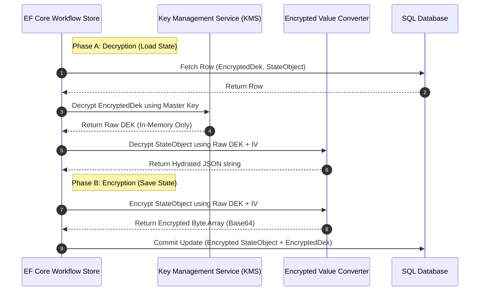

# State Payload Encryption at Rest

This document specifies the design for encrypting the serialized JSON `StateObject` blob in the database, ensuring security compliance (e.g., GDPR, HIPAA, PCI-DSS) for sensitive workflow variables.

---

## 1. Architectural Strategy: Envelope Encryption

Directly calling a Key Management Service (KMS) such as Azure Key Vault or AWS KMS on every workflow serialization/deserialization tick adds unacceptable network latency (typically 50-100ms). 

To solve this, we use **Envelope Encryption**:

1.  **Master Key (KEK)**: Stored securely in an external KMS.
2.  **Data Encryption Key (DEK)**: A symmetric key generated locally per workflow instance.
3.  **Encrypted DEK**: The DEK is encrypted using the KMS Master Key and stored alongside the workflow instance metadata in the database.
4.  **Local Decryption**: The runner decrypts the DEK *once* via KMS when loading the workflow, then uses that DEK in memory for high-speed local symmetric encryption/decryption.

---

## 2. Key Management & Db Schema

The `WorkflowInstances` persistence model is updated to store encryption metadata.

### Schema Updates
*   **IsEncrypted** (Boolean): Indicates whether the state object payload is encrypted.
*   **EncryptedDek** (Byte Array): The symmetric DEK encrypted with the KMS Master Key.
*   **InitializationVector (IV)**: Used as salt for the symmetric cipher block.
*   **StateObject** (Encrypted JSON): Stores the base64-encoded encrypted payload.

---

## 3. Cryptographic Operations Flow



---

## 4. Implementation details (EF Core Interception)

The encryption is handled transparently inside the EF Core persistence provider using a custom `ValueConverter`.

```csharp
public class EncryptedStateConverter : ValueConverter<string, string>
{
    public EncryptedStateConverter(IEncryptionService encryptionService)
        : base(
            v => encryptionService.Encrypt(v), // Encrypted to save in DB
            v => encryptionService.Decrypt(v)  // Decrypted to load in memory
        )
    {
    }
}

// Configured in DbContext OnModelCreating
builder.Entity<WorkflowInstanceEntity>()
    .Property(x => x.StateObject)
    .HasConversion<EncryptedStateConverter>();
```

### Encryption Algorithm
*   **Cipher**: **AES-256-GCM** (Galois/Counter Mode).
*   **Rationale**: Provides both confidentiality and integrity verification (authenticated encryption), rendering tampering attempts detectable before decryption.
*   **IV Allocation**: A cryptographically secure random 12-byte initialization vector is generated for every write operation.

---

## 5. Performance Optimizations & Caching

To reduce KMS API costs and latency:
*   **DEK Caching**: Decrypted DEKs are cached in memory for active workflows using a sliding expiration policy (e.g., 5 minutes). This is especially useful for workflows processing consecutive signals in `Immediate` execution mode, eliminating KMS network calls entirely on subsequent execution ticks.
