# Architecture Guide: Command Execution Modes

The `CommandExecutionMode` dictates whether the Runner should execute a command instantly in RAM (blocking the state machine momentarily) or suspend the workflow entirely and delegate the execution to the Orchestrator's I/O layer.

There are two primary modes:
1. **`CommandExecutionMode.Direct`** (Fast Commands)
2. **`CommandExecutionMode.Dispatched` / `Deferred`** (Slow Commands / Request-Response)

## 1. `CommandExecutionMode.Direct` (The "Fast" Path)
**Use Case:** Internal calculations, local state updates, fast synchronous validations, or fire-and-forget messaging where the workflow *does not* need to wait for a reply.

**The Philosophy:** If a command takes less than a few milliseconds, it is an absolute waste of resources to serialize the workflow, save it to the database, and wake it back up just to do math. The Runner handles it immediately.

### Step-by-Step Lifecycle (`Direct`)
1. **Yield:** The C# workflow hits `yield return ExecuteCommand(new CalculateTaxCommand(), ExecutionMode.Direct)`.
2. **Runner Intercepts:** The Runner pulls the yielded `CommandWait` object inside its evaluation `while` loop.
3. **Execution in RAM:** The Runner checks the mode. Seeing `Direct`, it asks the `ICommandHandlerFactory` for the local handler.
4. **Synchronous Compute:** The Runner executes the compiled delegate/handler instantly in memory.
5. **State Update:** The result of the command is injected directly into the workflow's local variables (closure).
6. **Immediate Advance:** The Runner calls `.MoveNextAsync()` to advance the state machine to the next line of code without ever breaking the `while` loop or talking to the database.

*Result: Zero database I/O. Lightning fast.*

---

## 2. `CommandExecutionMode.Dispatched` (The "Slow" Path)
**Use Case:** External API calls (e.g., Stripe, SendGrid), long-running microservice tasks, or any interaction where the workflow must send a message and wait for an asynchronous reply.

**The Philosophy:** The Runner is a pure compute unit; it should never sit idle waiting for an external HTTP call or message queue to return. If a command requires a callback, the Runner must safely pack up the workflow and hand it back to the Orchestrator.

### Step-by-Step Lifecycle (`Dispatched`)

#### Phase A: Suspension (Compute -> IO)
1. **Yield:** The workflow hits `yield return ExecuteCommand(new ChargeCreditCardCommand(), ExecutionMode.Dispatched)`.
2. **Runner Intercepts & Halts:** The Runner sees the `Dispatched` mode. It **breaks** its `while` loop. It packages the current `WorkflowRunContext` (state snapshot) and the `CommandWait` request, sending them back to the Orchestrator.
3. **Persistence:** The Orchestrator receives the payload. It saves the `WorkflowRunContext` to the NoSQL document store and inserts the `CommandWait` into the SQL database, generating a unique `WaitId` (Correlation ID).

#### Phase B: Dispatch (IO -> External World)
4. **Message Broker:** The Orchestrator wraps the `ChargeCreditCardCommand` in an envelope, stamps the header with the `WaitId`, and pushes it to RabbitMQ/Kafka.
5. **External Processing:** The external Billing Microservice picks up the message, charges the card, and eventually publishes a `ChargeCardResult` back to the broker, explicitly including the `WaitId`.

#### Phase C: Resumption (IO -> Compute)
6. **O(1) Lookup:** The Orchestrator receives the result from the broker. It uses the `WaitId` to run a blazing-fast SQL query: `SELECT WorkflowInstanceId FROM CommandWaits WHERE Id = @WaitId`.
7. **Wake Up:** The Orchestrator loads the sleeping `WorkflowRunContext` and sends it, along with the `ChargeCardResult`, to an available Runner.
8. **Hydration & Advance:** The Runner uses the `StateMachineAdvancer` to force-feed the state back into the C# class, injects the payment result, and calls `.MoveNextAsync()`. The workflow wakes up on the exact next line of code.

---

### Summary Checklist for Workflow Authors
* If it **returns instantly** (Math, formatting, local DB reads) ➔ Use **`Direct`**.
* If it **talks to the outside world** (APIs, Queues, Microservices) ➔ Use **`Dispatched`**.

-----------
Here are the four major architectural benefits of using `ExecutionMode.Direct`:

```csharp
// Option A: Direct C# Call (Invisible to Engine)
var tax = CalculateTax(orderAmount);

// Option B: Engine Command (ExecutionMode.Direct)
yield return ExecuteCommand(new CalculateTaxCommand(orderAmount), ExecutionMode.Direct);
```

### 1. The Audit Trail (Observability)
When you call a method directly (Option A), the workflow engine has no idea it happened. If the workflow crashes or you need to debug a state transition, that calculation is missing from the logs. 
When you yield it as a `Direct` command (Option B), the Runner can log the exact intent, the input parameters (`CalculateTaxCommand`), and the result into your telemetry or database. You get a perfect, step-by-step history of the business logic.

### 2. Saga Tracking & Compensation
This is the most critical benefit. As we discussed in the Saga architecture, the Runner tracks completed commands by their `Tokens` so it knows what to undo if something fails later.
* **If you use Option A:** The engine doesn't know the action happened, so it cannot automatically compensate for it.
* **If you use Option B:** The Runner records that this command succeeded. If the workflow later yields `Compensate("TaxToken")`, the engine automatically knows to fire the exact rollback logic for that specific tax calculation.

### 3. Engine Middleware (Retries & Error Handling)
If a fast, synchronous command involves something fragile (like reading a local file or querying a fast local Redis cache), calling it directly means you have to write manual `try/catch` and `while` loops to handle transient errors.
By yielding it to the Runner, you get to use the engine's fluent configuration for free:
```csharp
yield return ExecuteCommand(new ReadLocalConfigCommand(), ExecutionMode.Direct)
    .WithRetries(maxAttempts: 3, backoff: TimeSpan.FromSeconds(1));
```
The Runner handles the `try/catch` and retry logic internally, keeping the workflow code beautiful and flat.

### 4. Dependency Injection & Decoupling
If your workflow class calls methods directly, you have to inject all the required services (e.g., `ITaxCalculator`, `ILocalCache`, `IDiscountService`) directly into your `WorkflowContainer`'s constructor. Over time, your workflow class becomes bloated with 20 different dependencies.
By using `ExecutionMode.Direct`, the workflow only yields a POCO (Plain Old C# Object) representing the *intent*. The Runner's `ICommandHandlerFactory` takes over, resolves the correct handler from the DI container, and executes it. The workflow remains 100% decoupled from the implementation details.

### The Verdict: When to use which?
* **Use Direct C# Calls (`x = 5`, `list.Add()`)** for completely trivial internal logic, string formatting, or basic math where logging and retries don't matter.
* **Use `ExecutionMode.Direct`** for domain-significant actions (e.g., updating a local database, applying complex business rules, generating a critical document) where you want logging, error handling, decoupling, or the ability to undo the action later via the Saga pattern.

```mermaid
sequenceDiagram
    autonumber
    
    box rgb(40, 44, 52) Compute Node
        participant WF as C# Workflow
        participant Runner as Stateless Runner
    end
    
    box rgb(20, 50, 80) IO & Routing
        participant Orch as Orchestrator
        participant DB as SQL / NoSQL
        participant Bus as Message Broker
    end
    
    participant Ext as External System

    %% DIRECT MODE
    rect rgb(20, 60, 20)
    note right of WF: Phase 1: ExecutionMode.Direct (Fast Command)
    WF->>Runner: yield return ExecuteCommand(new CalcTax())
    Runner->>Runner: Instantiate CommandHandler
    Runner->>Runner: Execute Synchronously in RAM
    Runner->>WF: Inject Result & MoveNextAsync() (Zero IO)
    end

    %% DISPATCHED MODE
    note right of WF: Phase 2: ExecutionMode.Dispatched (Slow Command)
    
    rect rgb(60, 20, 20)
    WF->>Runner: yield return ExecuteCommand(new ChargeCard())
    Runner->>Orch: Suspend & Send [WorkflowContext + Command]
    Orch->>DB: Save Context & Create WaitId (Guid)
    Orch->>Bus: Publish Request (Header: WaitId)
    end
    
    rect rgb(60, 40, 20)
    Bus->>Ext: Consume Request
    note right of Ext: Processing... (Seconds to Hours)
    Ext->>Bus: Publish Response (Header: WaitId)
    end
    
    rect rgb(20, 20, 60)
    Bus->>Orch: Consume Response
    Orch->>DB: O(1) Lookup by WaitId
    DB-->>Orch: Return sleeping WorkflowContext
    Orch->>Runner: Dispatch [WorkflowContext + Result]
    Runner->>WF: Hydrate State, Inject Result & MoveNextAsync()
    end
```

