# Workflows.sln Project Dependency Graph

This diagram shows the direct project-to-project references inside `Workflows.sln`. Arrows point from a project to the projects it directly references.

```mermaid
graph TD
    %% Foundation / Core libraries
    Primitives["Workflows.Primitives"]
    Abstraction["Workflows.Abstraction"]
    Communication["Workflows.Communication.Abstraction"]
    Definition["Workflows.Definition"]
    CommonAbstraction["Workflows.Common.Abstraction"]

    Abstraction --> Primitives
    Definition --> Primitives
    Definition --> Abstraction
    CommonAbstraction --> Abstraction
    CommonAbstraction --> Communication
    CommonAbstraction --> Definition

    %% Runtime
    Runner["Workflows.Runner"]
    Orchestrator["Workflows.Orchestrator"]
    RunnerTestShell["Workflows.Runner.TestShell"]

    Runner --> Abstraction
    Runner --> CommonAbstraction
    Runner --> Communication
    Runner --> Definition
    Orchestrator --> Abstraction
    Orchestrator --> CommonAbstraction
    Orchestrator --> Communication
    RunnerTestShell --> Runner

    %% Storage
    StorageEF["Workflows.Storage.EntityFrameworkCore"]
    StorageSqlite["Workflows.Storage.Sqlite"]
    StoragePostgres["Workflows.Storage.Postgres"]
    StorageSqlServer["Workflows.Storage.SqlServer"]

    StorageSqlite --> StorageEF
    StoragePostgres --> StorageEF
    StorageSqlServer --> StorageEF

    %% Clients
    Client["Workflows.Client"]
    ClientWebApi["Workflows.Client.WebApi"]
    ClientGrpc["Workflows.Client.gRPC"]

    Client --> Abstraction
    Client --> Communication
    ClientWebApi --> Client
    ClientGrpc --> Client

    %% Admin UI
    AdminUI["Workflows.Admin.UI"]

    AdminUI --> Abstraction
    AdminUI --> StorageEF
    AdminUI --> StorageSqlite
    AdminUI --> StorageSqlServer
    AdminUI --> StoragePostgres

    %% Hosting
    HostingInProcess["Workflows.Hosting.InProcess"]

    HostingInProcess --> Orchestrator
    HostingInProcess --> Runner
    HostingInProcess --> StorageSqlite

    %% Tools
    Analyzers["Workflows.Analyzers"]

    %% Samples
    SampleInProcessSqlite["InProcessSqliteSample"]
    SampleAdminUI["Workflows.Admin.UI.Sample"]
    SampleWorkflow["WorkflowSample"]

    SampleInProcessSqlite --> Analyzers
    SampleInProcessSqlite --> Definition
    SampleInProcessSqlite --> HostingInProcess
    SampleInProcessSqlite --> StorageSqlite
    SampleInProcessSqlite --> Abstraction
    SampleInProcessSqlite --> CommonAbstraction

    SampleAdminUI --> AdminUI
    SampleAdminUI --> Orchestrator
    SampleAdminUI --> HostingInProcess
    SampleAdminUI --> StorageSqlite

    SampleWorkflow --> Analyzers
    SampleWorkflow --> Definition
    SampleWorkflow --> Runner
    SampleWorkflow --> Abstraction

    %% Tests
    TestSomething["TestSomething"]
    TestRunner["Workflows.Runner.Tests"]

    TestSomething --> Abstraction
    TestSomething --> CommonAbstraction

    TestRunner --> Analyzers
    TestRunner --> CommonAbstraction
    TestRunner --> Runner
    TestRunner --> Definition
    TestRunner --> Abstraction
    TestRunner --> HostingInProcess
    TestRunner --> RunnerTestShell
    TestRunner --> Client
    TestRunner --> ClientWebApi
    TestRunner --> ClientGrpc
    TestRunner --> StorageEF
    TestRunner --> StorageSqlite
```

## Key Observations

- **Foundational layer**: `Workflows.Primitives` is referenced by `Workflows.Abstraction` and `Workflows.Definition`.
- **Central hub**: `Workflows.Common.Abstraction` pulls together `Workflows.Abstraction`, `Workflows.Communication.Abstraction`, and `Workflows.Definition`, and is consumed by `Workflows.Runner`, `Workflows.Orchestrator`, and several tests/samples.
- **Storage providers**: `Workflows.Storage.Sqlite`, `Workflows.Storage.Postgres`, and `Workflows.Storage.SqlServer` all depend on `Workflows.Storage.EntityFrameworkCore`.
- **Client stack**: `Workflows.Client.WebApi` and `Workflows.Client.gRPC` both depend on the shared `Workflows.Client` project.
- **Richest consumer**: `Workflows.Runner.Tests` references the most projects, covering runtime, hosting, clients, and storage.
- **Leaf tool project**: `Workflows.Analyzers` has no project references of its own.
