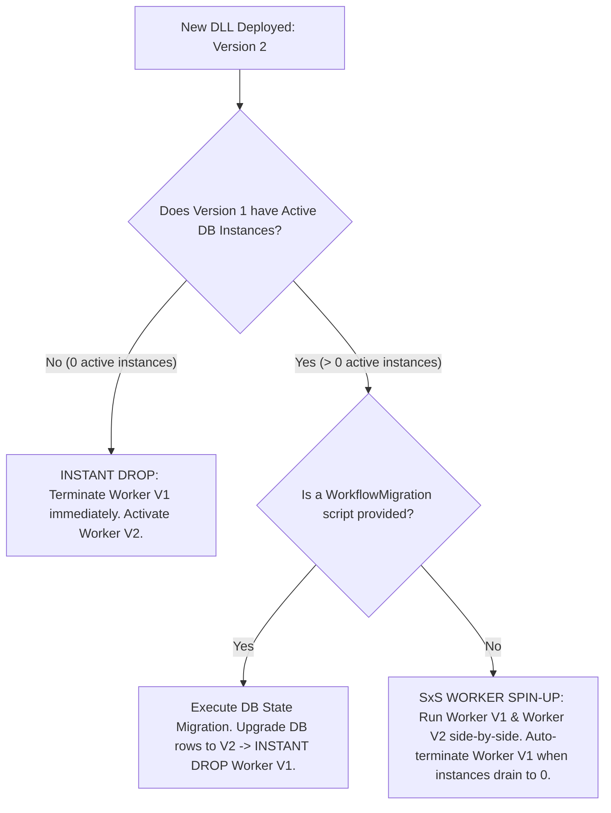

# How SxS (Side-by-Side) Execution & Process Supervision Works in .NET 10

## Executive Summary

This document provides an architectural overview of multi-version workflow execution using an **Out-of-Process Worker Supervisor Architecture**. To eliminate cross-version dependency conflicts, shared static memory leaks, and binding redirection traps associated with dynamic in-process `AssemblyLoadContext` (ALC) dynamic loading, the Workflows Engine isolates version assemblies into dedicated worker sub-processes managed by a central Host Supervisor.

---

## 1. Core Mechanics of Out-of-Process Process Supervision

Under this architecture:
- The **Main Engine Host** acts as a **Supervisor (Control Plane)**, managing process lifecycles, database persistence, and incoming signal routing.
- Each compiled assembly release runs in a dedicated **Worker Sub-Process (`Workflows.Worker`)**.
- Local IPC (gRPC over Named Pipes or Unix Domain Sockets) connects the Host Supervisor to child Workers with sub-millisecond latency.

---

## 2. Instant Drop vs. Side-by-Side (SxS) Worker Spin-Up

When a developer publishes a new release of a workflow assembly containing modified and new workflows, the engine evaluates whether Worker V1 can be dropped instantly or must run side-by-side with Worker V2:

### Instant Drop Criteria
You can **drop the old version process instantly** and activate only the new version process if:
1. **Zero Active Instances:** The database contains **0 active, suspended instances** of the changed workflow in `Running` status.
2. **In-Flight Migration Completed:** A `WorkflowMigration` script is executed during deployment to transform active V1 state JSON blobs into V2 schema format, setting `WorkflowVersion = 2` across the database.

---

## 3. Pre-Publish Impact Comparison Tool (`dotnet wf compare`)

Prior to publishing a release, developers utilize the **Pre-Publish Impact Wizard** (CLI / Admin UI tool):
1. **Roslyn AST Diff Engine:** Analyzes workflow definitions between Old vs. New assemblies to detect structural yield checkpoint drift.
2. **Live DB Impact Metrics:** Connects to the database to count active running instances per modified workflow.
3. **Deployment Decision Matrix:** Provides the exact deployment impact report and recommends whether to execute an **Instant Drop**, **Migration Script**, or **SxS Process Spin-Up**.