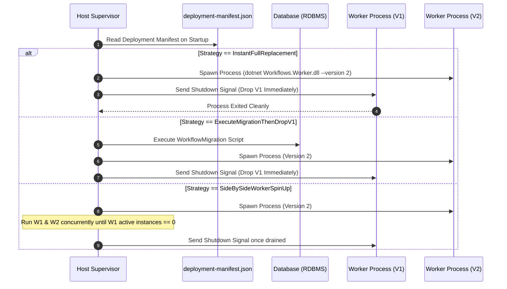

# 🏛️ Out-of-Process Worker Supervisor Architecture

## 1. Executive Summary

To eliminate cross-version dependency conflicts, shared static state leakage, and memory reference traps associated with in-process dynamic assembly loading (such as `AssemblyLoadContext`), the Workflows Engine utilizes an **Out-of-Process Worker Supervisor Architecture**.

Under this model:
- The **Main Engine Host** acts as a **Supervisor (Control Plane)**.
- Each version of a workflow assembly runs inside a dedicated, isolated **Worker Sub-Process (Data Plane)**.
- Communication between the Host Supervisor and Worker processes uses ultra-fast local IPC (gRPC over Named Pipes or Unix Domain Sockets).
- Deployment actions are guided deterministically by reading **`deployment-manifest.json`** generated by **WF Tools**.

---

## 2. Process Lifecycle & Manifest-Driven Deployment



### 1. Manifest-Driven Deployment Execution
Upon launching or detecting a deployment package, the Supervisor reads `deployment-manifest.json`:
- If `Strategy` is `InstantFullReplacement` or `ExecuteMigrationThenDropV1`: The Supervisor launches Worker V2 and **instantly drops Worker V1**.
- If `Strategy` is `SideBySideWorkerSpinUp`: The Supervisor runs Worker V1 and Worker V2 concurrently until `WorkerDrainWorker` confirms V1 active instances in DB == 0, then gracefully terminates Worker V1.

### 2. Spawning
When a Worker process is needed:
1. The Supervisor checks if a Worker process for `Version N` is active.
2. If not, it spawns a child process: `dotnet Workflows.Worker.dll --version N --ipc-pipe workflows-vN`.
3. The Worker connects back to the Supervisor via local IPC and sends a `Ready` handshake.

### 3. Graceful Decommissioning
The Supervisor runs a background worker (`WorkerDrainWorker`) that checks active instance counts:
```sql
SELECT COUNT(*) FROM WorkflowInstances 
WHERE WorkflowName = @WorkflowName AND WorkflowVersion = @Version AND Status = 1; -- Running
```
When the count reaches **0**, the Supervisor sends a graceful `Shutdown` IPC command. The Worker flushes logs, closes DB connection pools, and exits cleanly.

---

## 3. Advantages over In-Process ALC

| Dimension | In-Process ALC | Out-of-Process Worker Supervisor |
| :--- | :--- | :--- |
| **Dependency Isolation** | 🟡 Risk of assembly binding conflicts | 🟢 **100% Process Boundary Isolation** |
| **Static State Safety** | 🔴 Static variables bleed across ALCs | 🟢 **Zero Bleed** (Isolated memory) |
| **Memory Reclamation** | 🔴 Cooperative GC unloading traps | 🟢 **OS Level Reclamation** on Process Exit |
| **Crash Resilience** | 🔴 Unhandled Worker exception crashes host | 🟢 Worker crash isolated from Host Supervisor |
| **Deterministic Deploy** | 🟡 Host guesses runtime behavior | 🟢 **Guided by `deployment-manifest.json`** |
