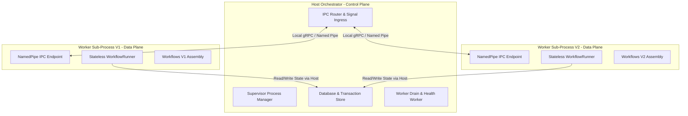

# Full Implementation Plan: Out-of-Process Worker Supervisor & WF Tools (`dotnet-wf`)

## 1. Overview & Architecture Vision

This plan details the full implementation of the **Out-of-Process Worker Supervisor Architecture** and the **WF Tools suite** (`dotnet-wf`).

The architecture strictly separates **Control Plane (Host Orchestrator)** from **Data Plane (Stateless Worker Sub-Processes)** to achieve 100% process-level boundary isolation, eliminating `AssemblyLoadContext` memory leaks and cross-version dependency conflicts.



---

## 2. Deep Dive: What `Workflows.Worker` Contains

`Workflows.Worker` is a standalone, lightweight, **zero-database**, stateless compute sub-process.

### 📦 Key Components of `Workflows.Worker`:

1. **Assembly Plugin Loader (`WorkerAssemblyLoader`)**:
   - Takes command-line arguments passed by the Host Supervisor:
     ```bash
     dotnet Workflows.Worker.dll --version "1.0.0" --ipc-pipe "wf-worker-v1.0.0" --assembly-path "d:/MySrc/Workflows/Archive/Binaries/V1/MyWorkflows.V1.dll"
     ```
   - Loads the designated version assembly and registers all `[Workflow]` container classes into `WorkflowRegistry`.

2. **Stateless Compute Engine (`WorkflowRunner`)**:
   - Pure in-memory state machine advancer (`Workflows.Runner`).
   - Accepts `WorkflowExecutionRequest` containing the JSON `StateObject` and triggering signal/command payload.
   - Advances generator `yield return` checkpoints, compiles match expressions, fires `.AfterMatch()` side effects, and updates `WaitGroup` statuses in RAM.
   - Returns `WorkflowRunResult` (updated state object, new wait DTOs to insert, consumed wait IDs to prune) over IPC.

3. **IPC Server Transport (gRPC / Named Pipes)**:
   - Uses `System.IO.Pipes.NamedPipeServerStream` (Windows) / Unix Domain Sockets (Linux).
   - Zero external network ports! Local IPC only.
   - Protocol RPCs:
     - `Handshake(WorkerId, Version)`: Initial registration handshake with Host Supervisor.
     - `RunWorkflow(WorkflowExecutionRequest)`: Executes workflow state machine tick.
     - `RunCompensation(CompensationRequest)`: Executes rollback delegates.
     - `Shutdown()`: Graceful flush, cleanup, and process exit.

4. **Minimal In-Memory DI Container (`IServiceProvider`)**:
   - Contains **zero database drivers or connections** (`WorkflowsDbContext` lives exclusively in the Host!).
   - Registers only serializers, reflection metadata, and the stateless runner.

---

## 3. Proposed Changes & Component Architecture

### Component 1: `Workflows.Worker` (New Executable Project)
- `Program.cs`: Worker entry point parsing command-line parameters (`--version`, `--ipc-pipe`, `--assembly-path`).
- `IpcWorkerService.cs`: Listens on Named Pipe / IPC channel for host execution commands.
- `WorkerAssemblyLoader.cs`: Loads workflow assembly version and registers containers.

### Component 2: `Workflows.Host.Supervisor` (In `Workflows.Hosting.InProcess` / Host package)
- `WorkerProcessSupervisor.cs`: Spawns, monitors, and health-checks child `Workflows.Worker` processes.
- `IpcWorkerClient.cs`: IPC client sending `WorkflowExecutionRequest` to specific worker version sub-processes.
- `WorkerDrainWorker.cs`: Background worker querying DB active instance counts per version and triggering graceful worker shutdown when active instances reach `0`.
- `ManifestDeploymentEngine.cs`: Reads `deployment-manifest.json` on startup and evaluates live DB instance counts to execute Instant Drop vs. SxS Process Spin-Up.

### Component 3: `Workflows.Tools.CLI` (`dotnet-wf` CLI & Admin UI Tool Suite)
- `WorkflowDiffAnalyzer.cs`: Roslyn AST parser comparing old vs. new workflow definitions offline.
- `WorkflowSchemaGenerator.cs`: Emits versioned `WorkflowName_vX_Schema.json` contract snapshots.
- `MigrationBoilerplateGenerator.cs`: Generates `OrderWorkflowMigration_V1_To_V2.cs` C# migration classes with fail-loud `AutoMapFrom` assertions.
- `DeploymentManifestGenerator.cs`: Serializes wizard decisions to `deployment-manifest.json`.

---

## 4. Rollout & Execution Plan Sequence

The execution will follow a strict, gated 5-step sequence:

```
┌─────────────────────────────────────────────────────────────────────────┐
│                    Step 1: Point 3 AST Verification                     │
│  Ship Roslyn AST Schema-Drift Verification for nested types & generics  │
└────────────────────────────────────┬────────────────────────────────────┘
                                     │
                                     ▼
┌─────────────────────────────────────────────────────────────────────────┐
│                   Step 2: Workflows.Worker & IPC                        │
│  Build Workflows.Worker sub-process & Host Supervisor IPC channel      │
└────────────────────────────────────┬────────────────────────────────────┘
                                     │
                                     ▼
┌─────────────────────────────────────────────────────────────────────────┐
│                   Step 3: WF Tools (`dotnet-wf`)                        │
│  Build offline comparison, schema JSON generator, and migration gen   │
└────────────────────────────────────┬────────────────────────────────────┘
                                     │
                                     ▼
┌─────────────────────────────────────────────────────────────────────────┐
│                Step 4: Manifest & Live DB Evaluator                     │
│  Build manifest reader + Live DB count evaluator + 15-min Grace Period  │
└────────────────────────────────────┬────────────────────────────────────┘
                                     │
                                     ▼
┌─────────────────────────────────────────────────────────────────────────┐
│                  Step 5: End-to-End Verification                        │
│  Integration tests for Instant Drop, Migration, & SxS Process Spin-up   │
└─────────────────────────────────────────────────────────────────────────┘
```

---

## 5. Verification Plan

### Automated Unit & Integration Tests
1. **Worker IPC Handshake Tests (`WorkerIpcTests`)**:
   - Verify Host Supervisor successfully spawns `Workflows.Worker`, executes handshake, sends `RunWorkflow`, receives `WorkflowRunResult`, and triggers `Shutdown`.
2. **Stateless Worker Crash Recovery Tests (`WorkerCrashRecoveryTests`)**:
   - Simulate `Workflows.Worker` process crash mid-step. Verify zero DB mutation, host process detection, automatic worker respawn, and idempotent retry.
3. **AST Diff & Schema Generator Tests (`SchemaGeneratorTests`)**:
   - Test `WorkflowSchemaGenerator` emitting valid `WorkflowName_vX_Schema.json` contract files.
   - Test Roslyn AST diff detecting unchanged, non-breaking, and breaking yield checkpoint shifts.
4. **Fail-Loud `AutoMapFrom` Isolation Tests (`MigrationIsolationTests`)**:
   - Verify unmapped property mismatch throws `WorkflowMigrationException`, quarantines *only* that single instance to Version 1 on Worker V1, while sibling instances migrate cleanly.
5. **Instance-Locked Concurrency Tests (`RollbackConcurrencyTests`)**:
   - Verify `InstanceLockManager` serializes grace-window rollbacks and late compensation triggers cleanly without race conditions.

### Manual Verification
- Execute `dotnet-wf compare` CLI against sample workflows and verify `deployment-manifest.json` generation.
- Run `InProcessSqliteSample` with Worker sub-process supervision enabled, trigger workflow steps, and verify automatic worker decommissioning when active instances reach zero.
